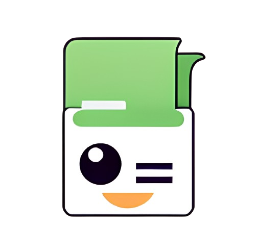
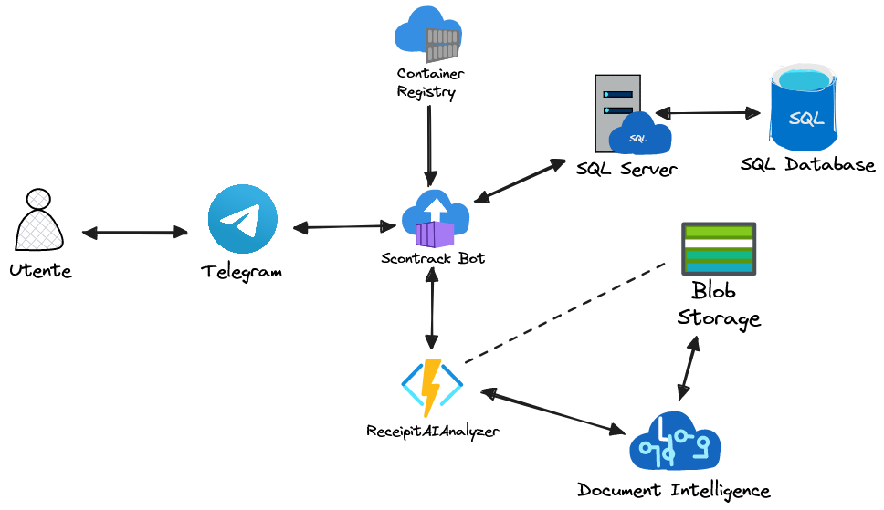

# Scontrack



Scontrack è un Bot Telegram che tramite i servizi di Azure consente di tener traccia delle spese degli scontrini semplicemente scattandone una foto. In questo modo va a creare un sistema pratico che consente di memorizzare gli scontrini dell’ultimo periodo in modo da poterli riportare successivamente per migliorare la fase di budgeting.

**Questo è un progetto a scopo didattico. Non è da considersi production-ready.**

## Autore

- [@Alessio Maddaluno](https://www.github.com/AlessioMaddaluno)

## Requisiti

- [Azure CLI](https://learn.microsoft.com/en-us/cli/azure/)
- [Azure Subscription](https://azure.microsoft.com/it-it/pricing/)
- [Docker](https://www.docker.com/)
- [Telegram](https://telegram.org/)

## Architettura




## Preparazione e previsioning componenti Azure

Per poter deployare il progetto è necessario buildare l'immagine docker che conterrà l'applicativo Java che gestirà il bot.

```bash
  git clone https://github.com/AlessioMaddaluno
  cd scontrack-bot
  docker build . -t scontrack-bot
  docker tag scontrack-bot scontrackregistry.azurecr.io/scontrack-bot:0.1
```

A questo punto è necessario definire una serie di variabili che andranno ad essere utilizzate per i comandi precedenti allo scopo di fare il previsioning e deploy delle varie componenti Azure. Il nome è parlante e verranno popolate man mano che verranno create le risorse. Il valore di ogni variabile a cui si fa riferimento è indicativo, per questione di sicurezza.

### Bot Telegram

Per creare un bot telegram è sufficiente rifarsi alla guida di [@BotFather](https://botostore.com/c/botfather/). La creazione di un bot produce un token necessario al funzionamento dell'applicativo.

### Resource Group

La prima cosa da creare è un resource group che andrà a contenere tutte le risorse del progetto. La location utilizzata sarà europe-west per una minore latenza.

```bash
az group create \
    --name $AZ_RESOURCE_GROUP \
    --location $AZ_LOCATION
```

### Storage Account e Blob Container

Lo storage account è necessario per la creazione del blob container che conterrà le immagini scattate dagli utenti e per il deploy della function app.

```bash
az storage account create \
  --name $AZ_STORAGE_ACCOUNT \
  --location $AZ_LOCATION \
  --resource-group $AZ_RESOURCE_GROUP \
  --sku Standard_LRS

az group create \
    --name $AZ_RESOURCE_GROUP \
    --location $AZ_LOCATION
```

### Container Registry

Il container registry conterrà l'immagine Docker in questo modo avremo un registro completamente indipendnete da DockerHub.

```bash
az acr create \
    --resource-group $AZ_RESOURCE_GROUP \
    --name $AZ_REGISTRY_NAME \
    --sku Basic
```

### Cognitive Service

Verrà usato il Cognitive Service, in particolare la parte relativa alla Document Intelligence come AI as a Service, per farlo è necessario generare una risorsa associata.

```bash
az cognitiveservices account create \
    --resource-group $AZ_RESOURCE_GROUP \
    --name scontrack-receipt-analyzer \
    --location $AZ_LOCATION \
    --sku F0 \
    --kind FormRecognizer
```

### Function App

A questo punto possiamo creare la Function App che farà da contanitore per il deploy della Function app successivamente. La function app è scritta in linguaggio python pertanto configureremo un ambiente runtime associato.

```bash
az functionapp create \
    --resource-group $AZ_RESOURCE_GROUP \
    --consumption-plan-location $AZ_LOCATION \
    --name scontrack-receipt-analyzer \
    --runtime python \
    --runtime-version 3.10 \
    --functions-version 4 \
    --storage-account $AZ_STORAGE_ACCOUNT \
    --os linux
```

Dovendo accedere ai servizi di cognitive service, inseriremo una variabile d'ambiente che conterrà la key. In questo modo la function avrà accesso alla Document Intelligence.

```bash
az functionapp config appsettings set \
  --name scontrack-receipt-analyzer \
  --resource-group $AZ_RESOURCE_GROUP \
  --settings "AI_ANALYZER_KEY=$(az cognitiveservices account keys list --name scontrack-receipt-analyzer -g $AZ_RESOURCE_GROUP --query 'key1' -o tsv)"
```

### SQL Database

L'applicativo interagisce anche con un db SQL, in particolare verrà utilizzata l'istanza SQL Server fornita da Azure e creato un Database.

```bash
az sql server create \
    --resource-group $AZ_RESOURCE_GROUP \
    --name $AZ_DATABASE_NAME \
    --location $AZ_LOCATION \
    --admin-user $AZ_DATABASE_USER \
    --admin-password $AZ_DATABASE_PASSWORD

az sql db create \
    --resource-group $AZ_RESOURCE_GROUP \
    --name $AZ_DATABASE_NAME \
    --server $AZ_DATABASE_NAME
```

## Deployment

### Receipt AI Analyzer (Azure Function)

Per poter fare il deploy dell'applicativo è necessario innanzitutto deployare la function app, per farlo è sufficente accedere alla directory che ne contiene il codice sorgente

```bash
  cd receipt-ai-analyzer
```

Successivamente è possibile lanciare il deploy della Function da CLI:

```bash
  func azure functionapp publish scontrack-receipt-analyzer
```

### Scontrak Bot (Container)

Avendo nella sezione precedente buildato l'immagine docker, per poterla pushare sul registry Azure creato in precedenza è sufficiente accedervi e lanciare il comando docker push:

```bash
  az acr login --name scontrackregistry
  docker push scontrackregistry.azurecr.io/scontrack-bot:0.1
```

Una volta pushata l'immagine è possibile creare un container a partire dall'immagine:

```bash
az container create \
    --resource-group $AZ_RESOURCE_GROUP \
    --name scontrack-telegram-bot \
    --image $AZ_REGISTRY_NAME.azurecr.io/$DOCKER_IMAGE_NAME:0.1 \
    --cpu 1 \
    --memory 1.5 \
    --registry-login-server $AZ_REGISTRY_NAME.azurecr.io \
    --registry-username $AZ_REGISTRY_NAME \
    --registry-password $(az acr credential show --name $AZ_REGISTRY_NAME --query "passwords[0].value" --output tsv) \
    --environment-variables \
        AZ_DATABASE_USER=$AZ_DATABASE_USER \
        AZ_DATABASE_PASSWORD=$AZ_DATABASE_PASSWORD \
        TELEGRAM_TOKEN=$TELEGRAM_TOKEN \
        AZURE_BLOB_STORAGE_KEY=$AZ_BLOB_STORAGE \
        AZURE_RECEIPS_AI_ENDPOINT=$AZ_RECEIPT_AI_ENDPOINT
```
